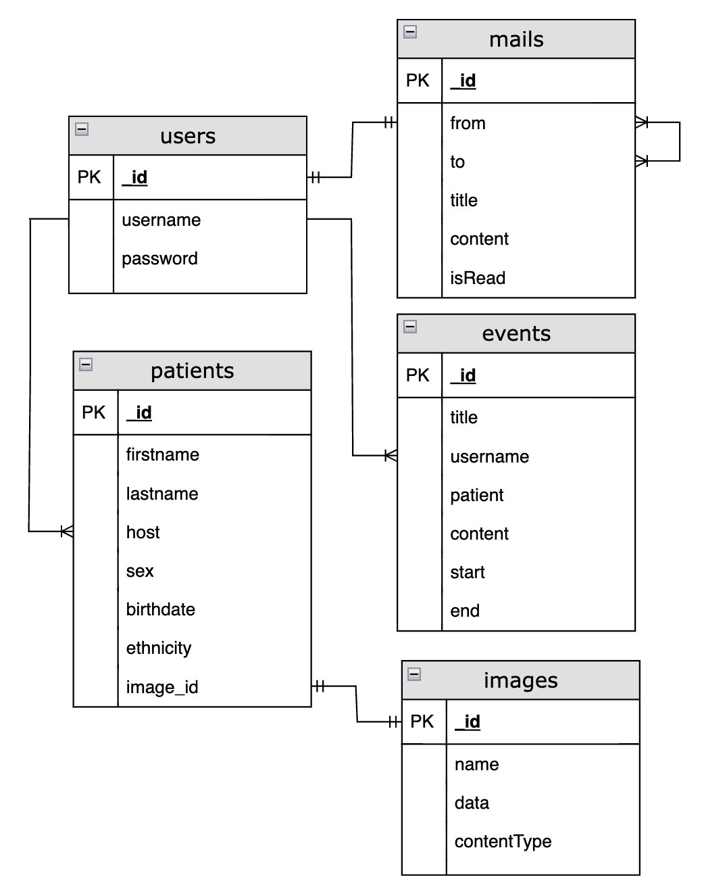

# Eletronic Health Record System

A simple healthcare system application has been developed for use by physicians, hospital staff, and potential patients. This application allows users to perform various functions, including creating, updating, and deleting calendar events, as well as managing patient information. Additionally, the messaging feature enables users to communicate with senders and receivers through email. The frontend of the application is built using React, while it connects to the backend through the Health API by sending requests.

[](https://youtu.be/yAvIbZjLZE8)


## Features

- **Patient Reservation Calendar System:** Allows users to schedule and manage patient appointments on a calendar.
- **Patient Display:** Displays patients associated with the physician user.
- **Messaging System:** Enables communication between users through messaging.

## Frontend Dependencies
Key open-source libraries and dependencies used in the frontend:

[**React**](https://react.dev/): A JavaScript library for building user interfaces.

[**React Big Calendar**](https://github.com/jquense/react-big-calendar): An open-source calendar component for React. In the healthcare system application by leveraging this library to implement the Patient Reservation Calendar System.

[**axios**](https://www.npmjs.com/package/axios): A promise-based HTTP client for making API requests.

[**moment-timezone**](https://www.npmjs.com/package/moment-timezone): A library for handling time and time zones.

[**react-router-dom**](https://www.npmjs.com/package/react-router-dom): A library for routing in React applications.


## Backend Dependencies
key open-source libraries and dependencies used in the backend:

[**Express**](https://expressjs.com/): A Node.js web application framework.

[**Mongoose**](https://www.mongodb.com/): A database and ODM (Object-Document Mapper) for MongoDB.

[**bcryptjs**](https://www.npmjs.com/package/bcryptjs): A library for hashing passwords.

[**cors**](https://www.npmjs.com/package/cors): A middleware for handling Cross-Origin Resource Sharing.

[**dotenv**](https://www.npmjs.com/package/dotenv): A module for loading environment variables.

[**jsonwebtoken**](https://www.npmjs.com/package/jsonwebtoken): A library for creating and verifying JSON Web Tokens (JWT).

[**multer**](https://www.npmjs.com/package/multer): Middleware for handling file uploads.

[**passport-jwt**](https://www.npmjs.com/package/passport-jwt): Libraries for authentication.

## Getting Started

Follow these steps to run the project locally on your machine.

### Prerequisites

- Node.js installed on your machine. You can download it from [nodejs.org](https://nodejs.org/).


#### MongoDB

The healthcare system application uses MongoDB as the primary database system. MongoDB is a NoSQL database known for its flexibility, scalability, and support for handling unstructured or semi-structured data. MongoDB is used to store and manage various types of data in our application, including patient records, user information, and scheduling data. It allows users to handle dynamic and evolving data structures efficiently.

#### Setup

1. **Installation:**
   - Download and install [MongoDB Community Edition](https://www.mongodb.com/try/download/community).

2. **Run MongoDB:**
   - Start the MongoDB server with `mongod`.

3. **MongoDB Compass (Optional):**
   - Install [MongoDB Compass](https://www.mongodb.com/try/download/compass) for a GUI interface.

#### Configuration

Set MongoDB connection details (URL, port, and authentication) in  app configuration.

```javascript
const mongoose = require('mongoose');

const mongoURI = 'mongodb://localhost:27017/health';

mongoose.connect(mongoURI, {
  useNewUrlParser: true,
  useUnifiedTopology: true,
})
  .then(() => {
    console.log('Connected to MongoDB');
  })
  .catch((err) => {
    console.error('Error connecting to MongoDB:', err);
  });
```


### Installation

1. Navigate to the backend directory:

   `cd backend`

2. Install the backend dependencies:

   `npm install`

3. Run the server:

   `npm start`

The server side will start on `http://localhost:3001`


4. Navigate to the frontend directory:

   `cd frontend`

5. Install the frontend dependencies:

   `npm install`

6. Run the react:

   `npm start`

The client side will start on `http://localhost:3000`

### Server


#### Health API

The following API can be accessed at `http://localhost:3001/`

| Endpoint             | Auth Required | Get | Post | Put | Delete | Patch |
| -------------------- | ------------- | --- | ---- | --- | ------ | ----- |
| /register            | ✔︎             |     | ✔︎    |     |        |       |
| /login               | ✔︎             |     | ✔︎    |     |        |       |
| /events/             |               | ✔︎   | ✔︎    |     |        |       |
| /events/`<event_id>` |               |     |      | ✔︎   | ✔︎      |       |
| /patients            |               | ✔︎   | ✔︎    |     |        |       |
| /patients/search     |               | ✔︎   |      |     |        |       |
| /mails               |               | ✔︎   | ✔︎    |     |        |       |
| /mails/`<mail_id>`   |               |     |      |     | ✔︎      | ✔︎     |
| /images              |               |     | ✔︎    |     |        |       |
| /images/`<event_id>` |               | ✔︎   |      |     | ✔︎      |       |

#### Auth and Tokens

For this API, users are required to provide their credentials to access personalized information. These credentials are obtained through token requests, which are temporary codes that serve as proof of identity. Tokens eliminate the need to repeatedly provide a username and password with each request. The process for obtaining these tokens is detailed below.

#### Register

To sign up, frontend sends a `POST` request to the `/users` endpoint. Frontend will need to provide essential user information in the message body, which should be formatted as a JSON object. The required fields and format are as follows:


```
{
 username:<str>,                 // Required
 password:<str>,                 // Required
}
```

Only the `username` and `password` fields are required.

Once the user registration is successfully completed, the server will send a response message to the frontend to confirm the registration. After this step, the user can proceed to log in using the registered username and password for further access.

#### Login

In order to login with username and password, sending request in `/login` endpoint, with a `POST` method. Effectively, you will be sending the username and password in the authorization header.

#### Event

Event route in the endpoint is for creating, updating, deleting in the `Scheduler` tab. 


```
{
 title:<str>,                 // Optional
 username:<str>,              // Optional
 patient:<array>,             // Optional
 content:<array>,             // Optional
 patient:<array>,             // Optional
 start:<date>,                // Required
 end:<date>,                  // Required
}
```


#### Patients

Patient route in the endpoint is for adding, updating, deleting patient for each physician in the `Patient` tab. 


```
{
 firstname:<str>,              // Required
 middlename:<str>,             // Optional
 lastname:<str>,               // Required
 host:<str>,                   // Required
 birthdate:<date>,             // Required
 sex:<str>,                    // Required
 ethnicity:<str>,              // Required
 image_id:<str>,               // Required
}
```

#### Mails

Mail route in the endpoint is for sending and deleting messages for communication between users, such as, physician. User type the username of the receiver in the `To` filling box in the `Messages` tab.


```
{
 from:<str>,              // Required
 to:<str>,                // Required
 title:<str>,             // Optional
 content:<str>,           // Optional
 isRead:<bool>,           // Optional
}
```

#### Images

Image route in the endpoint is for storing, updating and deleting images in the database matching for each user. 


```
{
 name:<str>,                // Required
 data:<buffer>,             // Required
 contentType:<str>,         // Optional
}
```


#### Database

Health
