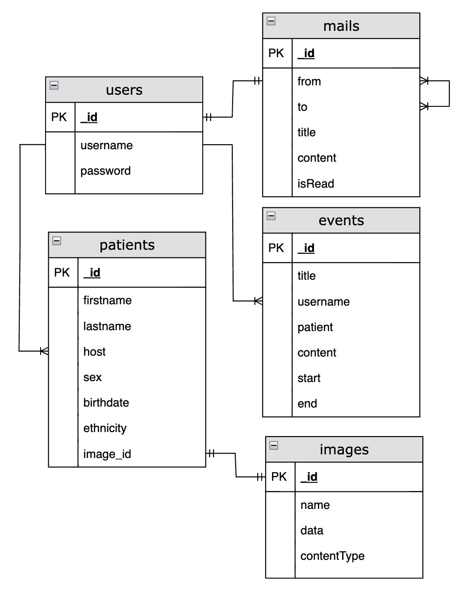

### Server

#### Health API

The following API can be accessed at `http://localhost:3001/`

| Endpoint             | Auth Required | Get | Post | Put | Delete | Patch |
| -------------------- | ------------- | --- | ---- | --- | ------ | ----- |
| /register            | ✔︎             |     | ✔︎    |     |        |       |
| /login               | ✔︎             |     | ✔︎    |     |        |       |
| /events/             |               | ✔︎   | ✔︎    |     |        |       |
| /events/`<event_id>` |               |     |      | ✔︎   | ✔︎      |       |
| /patients            |               | ✔︎   | ✔︎    |     |        |       |
| /patients/search     |               | ✔︎   |      |     |        |       |
| /mails               |               | ✔︎   | ✔︎    |     |        |       |
| /mails/`<mail_id>`   |               |     |      |     | ✔︎      | ✔︎     |
| /images              |               |     | ✔︎    |     |        |       |
| /images/`<event_id>` |               | ✔︎   |      |     | ✔︎      |       |

#### Auth and Tokens

For this API, users are required to provide their credentials to access personalized information. These credentials are obtained through token requests, which are temporary codes that serve as proof of identity. Tokens eliminate the need to repeatedly provide a username and password with each request. The process for obtaining these tokens is detailed below.

#### Register

To sign up, frontend sends a `POST` request to the `/users` endpoint. Frontend will need to provide essential user information in the message body, which should be formatted as a JSON object. The required fields and format are as follows:


```
{
 username:<str>,                 // Required
 password:<str>,                 // Required
}
```

Only the `username` and `password` fields are required.

Once the user registration is successfully completed, the server will send a response message to the frontend to confirm the registration. After this step, the user can proceed to log in using the registered username and password for further access.

#### Login

In order to login with username and password, sending request in `/login` endpoint, with a `POST` method. Effectively, you will be sending the username and password in the authorization header.

#### Event

Event route in the endpoint is for creating, updating, deleting in the `Scheduler` tab. 


```
{
 title:<str>,                 // Optional
 username:<str>,              // Optional
 patient:<array>,             // Optional
 content:<array>,             // Optional
 patient:<array>,             // Optional
 start:<date>,                // Required
 end:<date>,                  // Required
}
```


#### Patients

Patient route in the endpoint is for adding, updating, deleting patient for each physician in the `Patient` tab. 


```
{
 firstname:<str>,              // Required
 middlename:<str>,             // Optional
 lastname:<str>,               // Required
 host:<str>,                   // Required
 birthdate:<date>,             // Required
 sex:<str>,                    // Required
 ethnicity:<str>,              // Required
 image_id:<str>,               // Required
}
```

#### Mails

Mail route in the endpoint is for sending and deleting messages for communication between users, such as, physician. User type the username of the receiver in the `To` filling box in the `Messages` tab.


```
{
 from:<str>,              // Required
 to:<str>,                // Required
 title:<str>,             // Optional
 content:<str>,           // Optional
 isRead:<bool>,           // Optional
}
```

#### Images

Image route in the endpoint is for storing, updating and deleting images in the database matching for each user. 


```
{
 name:<str>,                // Required
 data:<buffer>,             // Required
 contentType:<str>,         // Optional
}
```


#### Database

Health

